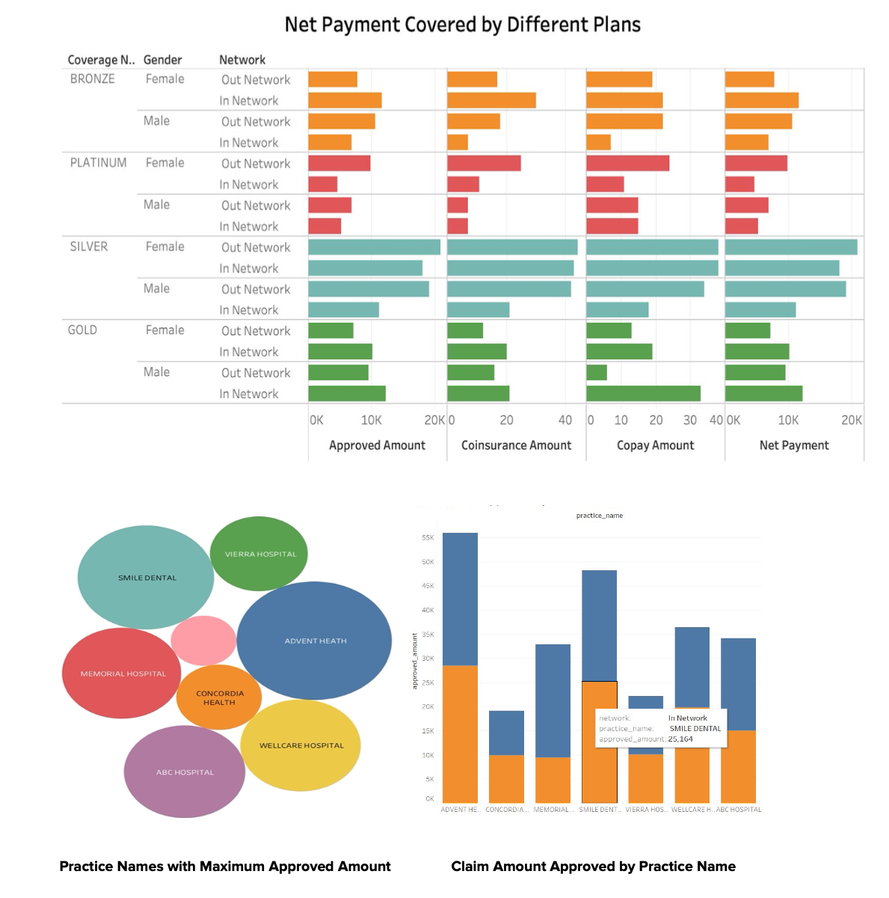

# Health Insurance Claim System
## Overview
Planned to design a real world health insurance claims database which involves information pertaining to the members, providers, claims, address, claim status, claim payment and coverage, and generated our own dataset which had 7 tables (described in the further sections). We formulated a relational database using MySQL Workbench and populated all 7 tables with approximately 100 rows each table.

## Project Goal
Main goal is to extract reports for the healthcare insurance officials which can enable them to analyse and present insights to the mangeorial officials, and to understand the entire Database Design process from scratch resulting into a development of a real world database and data visualization system for the health insurance companies.

## Logical Database Design (Entity Relationship Diagram)

## Data Visualizations (Exploratory Data Analysis)

## Queries to get the results
- **Reporting top 20 members along with provider details, billed amount and approved amount associated and having approved_amount greater than $2200 - Virtual Table/Views

Use health_insurance_claims_database;

create view top_20_claim_approved_customers as (select m.member_first_name, m.member_last_name, s.claim_status, p.provider_first_name, p.provider_last_name, p.network, p.practice_name, cp.billed_amount, cp.approved_amount, cp.net_payment from ((((member m inner join claim c on m.claim_id = c.claim_id) inner join status s on s.status_id = c.status_id) inner join provider p on p.claim_id = m.claim_id) inner join claim_payment cp on cp.claim_id = c.claim_id) where cp.approved_amount > 2200 order by cp.approved_amount desc limit 20);

select * from top_20_claim_approved_customers;
